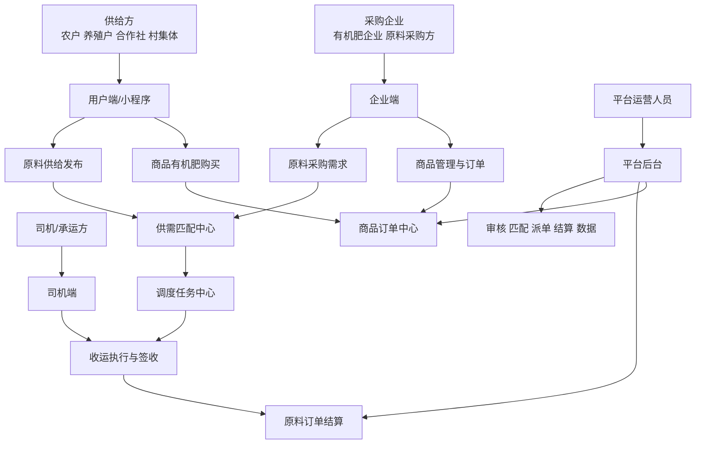
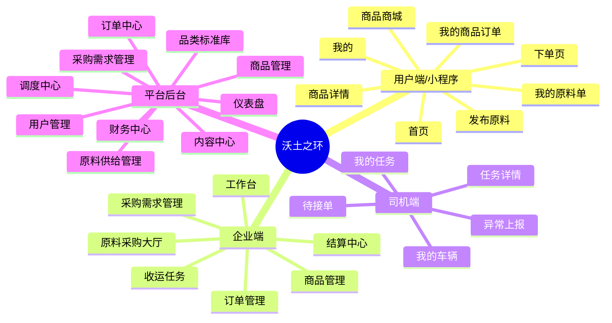
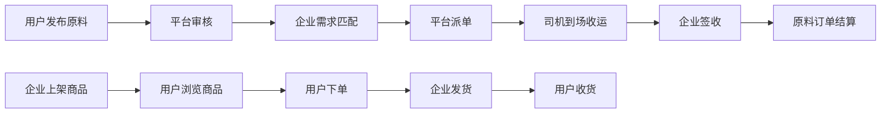

# 沃土之环 页面原型说明书 + 应用框架结构图

## 一、文档说明

本说明书用于指导“沃土之环”MVP阶段的页面原型设计、前端页面梳理、后台页面拆分与交互逻辑实现。

本文档适用对象：

- 产品经理
- UI设计师
- 前端开发
- 后端开发
- 运营团队

本文档目标：

- 明确平台各端页面组成
- 明确每个页面的核心目标
- 明确每个页面的主要模块与字段
- 明确关键按钮、状态和跳转关系
- 输出可直接用于讨论的应用框架结构图

---

## 二、产品角色与端划分

平台MVP阶段建议划分为 4 个端：

- 用户端/小程序
  - 面向农户、养殖户、合作社、村集体采购人员
- 企业端
  - 面向有机肥生产企业和原料采购方
- 司机端
  - 面向承运司机和收运车辆管理人员
- 平台运营后台
  - 面向审核、调度、财务、内容与运营管理人员

---

## 三、应用框架结构图

## 3.1 总体业务框架图

## 3.2 页面层级结构图

## 3.3 核心交易闭环图

---

## 四、原型设计总原则

## 4.1 页面设计原则

- 首版以“少页面、强闭环、易操作”为核心
- 用户端优先适配微信小程序
- 重点减少乡村用户输入成本，尽量采用：
  - 下拉选择
  - 单选按钮
  - 拍照上传
  - 地图定位
- 后台页面优先保障运营效率，不追求过度炫酷
- 所有状态型业务页面都必须体现当前状态、下一步动作、历史记录

## 4.2 交互设计原则

- 每个页面仅设置一个主操作按钮
- 关键业务状态必须可追踪
- 关键提交动作前给出确认提示
- 异常流程必须有兜底入口
- 图片、定位、重量、时间是高频字段，应尽量前置展示

## 4.3 命名规范建议

- 页面名称尽量使用业务名称，不用技术名称
- 按钮文案用动词开头，如：
  - 发布原料
  - 发起收运
  - 提交审核
  - 确认签收
- 状态命名统一使用后台与前端一致的中文术语

---

## 五、用户端/小程序原型说明

## 5.1 首页

### 页面目标

- 承接平台主要流量入口
- 引导用户进入原料发布和商品购买两个核心场景

### 页面模块

- 顶部定位栏
  - 当前地区
  - 切换位置
- 轮播Banner
  - 平台活动
  - 政策宣传
  - 热门商品
- 核心快捷入口
  - 发布原料
  - 我要买肥
  - 查看订单
  - 帮助中心
- 平台公告区
- 热门原料品类推荐
- 热门有机肥商品推荐
- 底部导航栏
  - 首页
  - 原料
  - 商城
  - 订单
  - 我的

### 关键按钮

- 发布原料
- 我要买肥
- 查看全部公告
- 查看更多商品

### 页面跳转

- 点击“发布原料”进入 `发布原料页`
- 点击“我要买肥”进入 `商品商城页`
- 点击“订单”进入 `订单聚合页`

---

## 5.2 发布原料页

### 页面目标

- 帮助用户快速发布可回收农业废弃物信息

### 页面模块

- 原料基本信息
  - 原料品类
  - 预估重量
  - 重量单位
  - 预估体积
- 原料属性信息
  - 含水率区间
  - 杂质情况
  - 堆放方式
  - 是否便于装车
- 位置信息
  - 地图定位
  - 详细地址
  - 联系人
  - 联系电话
- 时间信息
  - 可回收开始时间
  - 可回收结束时间
- 现场图片上传
- 补充说明

### 关键字段

| 字段 | 类型 | 是否必填 | 说明 |
| --- | --- | --- | --- |
| 原料品类 | 选择 | 是 | 如鸡粪、牛粪、秸秆、菌渣 |
| 预估重量 | 数字 | 是 | 建议统一为kg |
| 可回收时间 | 时间范围 | 是 | 平台安排收运依据 |
| 位置 | 地图定位 | 是 | 用于匹配与派单 |
| 联系人 | 文本 | 是 | 便于司机联系 |
| 现场图片 | 图片 | 否 | 用于审核和质量判断 |

### 关键按钮

- 保存草稿
- 提交审核

### 交互规则

- 未填写必填字段时不可提交
- 定位失败时支持手动输入地址
- 提交成功后跳转到 `我的原料单`

---

## 5.3 我的原料单页

### 页面目标

- 让用户查看已发布原料的处理进度和状态

### 页面模块

- 状态筛选标签
  - 全部
  - 待审核
  - 待匹配
  - 待收运
  - 已完成
  - 已取消
- 原料单列表卡片
  - 品类
  - 重量
  - 地址
  - 发布时间
  - 当前状态
- 列表操作区
  - 查看详情
  - 取消发布
  - 联系平台

### 详情页内容

- 原料基础信息
- 图片
- 匹配进度
- 收运信息
- 历史操作记录

### 关键按钮

- 查看详情
- 再次发布
- 联系客服

---

## 5.4 商品商城页

### 页面目标

- 承载用户浏览与购买商品有机肥的核心路径

### 页面模块

- 搜索栏
- 分类导航
- 筛选区
  - 价格
  - 适用作物
  - 配送范围
- 商品列表
  - 商品图
  - 商品名称
  - 规格
  - 单价
  - 销量/库存
- 推荐专区

### 关键按钮

- 查看详情
- 立即购买
- 加入询价单

---

## 5.5 商品详情页

### 页面目标

- 促成商品下单与询价

### 页面模块

- 商品主图
- 商品名称
- 价格区
- 规格和库存
- 适用作物说明
- 商品详情图文
- 配送范围说明
- 企业信息
- 用户须知

### 关键按钮

- 联系商家
- 加入询价单
- 立即下单

### 交互规则

- 库存不足时提示不可下单
- 若超出配送区域，提示联系平台确认

---

## 5.6 下单页

### 页面目标

- 完成商品订单提交

### 页面模块

- 收货地址
- 商品清单
- 购买数量
- 配送方式
- 运费说明
- 备注信息
- 金额汇总

### 关键按钮

- 提交订单

### 交互规则

- 提交后进入订单详情页
- MVP阶段可支持：
  - 线下支付登记
  - 询价确认后成交

---

## 5.7 我的商品订单页

### 页面目标

- 查看商品订单全流程状态

### 页面模块

- 订单状态筛选
  - 待支付
  - 待确认
  - 待发货
  - 待收货
  - 已完成
- 订单列表
- 订单操作区
  - 查看详情
  - 取消订单
  - 确认收货
  - 申请售后

---

## 5.8 我的页

### 页面目标

- 承载个人资料和常用配置

### 页面模块

- 用户信息卡
- 角色认证状态
- 地址管理
- 联系客服
- 帮助中心
- 意见反馈

### 关键按钮

- 去认证
- 管理地址
- 联系客服

---

## 六、企业端原型说明

## 6.1 工作台

### 页面目标

- 作为企业使用平台后的主入口，集中展示待办与核心数据

### 页面模块

- 今日待处理事项
  - 待审核供给
  - 待确认采购
  - 待签收任务
- 数据概览
  - 今日采购量
  - 本周成交量
  - 商品订单数
- 最新供给信息推荐
- 快捷入口
  - 新建需求
  - 查看采购大厅
  - 管理商品

---

## 6.2 原料采购大厅

### 页面目标

- 供企业查看全平台可采购原料，并筛选合适货源

### 页面模块

- 筛选区
  - 原料品类
  - 区域
  - 重量范围
  - 距离
  - 可回收时间
- 列表区
  - 原料卡片
  - 地图模式
- 详情抽屉/详情页
  - 供给信息
  - 图片
  - 地址
  - 联系方式
  - 历史匹配情况

### 关键按钮

- 发起匹配
- 立即收购
- 加入待选

---

## 6.3 采购需求管理

### 页面目标

- 让企业按计划发布采购需求并持续跟踪执行情况

### 页面模块

- 需求列表
- 需求状态筛选
- 新建需求表单
- 需求详情

### 新建需求字段

| 字段 | 类型 | 是否必填 | 说明 |
| --- | --- | --- | --- |
| 原料品类 | 选择 | 是 | 对应标准品类 |
| 目标数量 | 数字 | 是 | 计划采购量 |
| 最小收购量 | 数字 | 否 | 单笔最小可收 |
| 质量要求 | 文本/选项 | 是 | 含水率、杂质等 |
| 收购半径 | 数字 | 是 | 用于匹配范围 |
| 价格区间 | 数字区间 | 是 | 用于指导交易 |
| 期望时间 | 时间范围 | 否 | 用于排产安排 |

### 关键按钮

- 新建需求
- 编辑需求
- 关闭需求

---

## 6.4 收运任务页

### 页面目标

- 让企业查看与跟踪和自己相关的收运任务

### 页面模块

- 任务筛选
  - 待派单
  - 待到场
  - 运输中
  - 已签收
  - 异常
- 任务列表
- 任务详情
  - 司机信息
  - 运输路线
  - 提货照片
  - 到场时间
  - 签收状态

### 关键按钮

- 催办
- 查看运输轨迹
- 确认签收

---

## 6.5 商品管理页

### 页面目标

- 支持企业维护商品有机肥的上架、下架和库存信息

### 页面模块

- 商品列表
- 商品筛选
- 新增商品
- 编辑商品
- 库存管理

### 商品字段建议

| 字段 | 类型 | 是否必填 | 说明 |
| --- | --- | --- | --- |
| 商品名称 | 文本 | 是 | 如通用有机肥 |
| 商品分类 | 选择 | 是 | 对应商品分类 |
| 规格 | 文本 | 是 | 如40kg/袋 |
| 单位 | 文本 | 是 | 袋、吨等 |
| 销售价 | 金额 | 是 | 对外销售价格 |
| 库存 | 数字 | 是 | 当前库存 |
| 适用作物 | 文本 | 否 | 如玉米、果树 |
| 配送范围 | 文本 | 否 | 支持到县/乡镇 |

### 关键按钮

- 新增商品
- 上架
- 下架
- 修改库存

---

## 6.6 订单管理页

### 页面目标

- 管理原料订单与商品订单

### 页面模块

- 原料订单标签页
- 商品订单标签页
- 状态筛选
- 订单详情
- 导出功能

### 关键按钮

- 查看详情
- 导出订单
- 确认发货
- 确认签收

---

## 6.7 结算中心页

### 页面目标

- 管理账单、付款与收款记录

### 页面模块

- 账单列表
- 账单筛选
- 结算明细
- 付款登记
- 收款登记

### 关键按钮

- 登记付款
- 登记收款
- 导出账单

---

## 七、司机端原型说明

## 7.1 待接单页

### 页面目标

- 司机查看平台分配的待接单任务

### 页面模块

- 任务卡片
  - 提货地
  - 送达地
  - 计划时间
  - 预估重量
  - 运费
- 地图预览

### 关键按钮

- 接单
- 拒绝接单

---

## 7.2 我的任务页

### 页面目标

- 跟踪司机当前执行中的任务

### 页面模块

- 状态筛选
  - 已接单
  - 已到场
  - 运输中
  - 已完成
- 任务列表
- 任务进度时间轴

---

## 7.3 任务详情页

### 页面目标

- 支撑司机完成到场、装货、运输、签收等全流程动作

### 页面模块

- 基础任务信息
- 联系人信息
- 地图导航入口
- 到场打卡
- 装货拍照
- 重量录入
- 备注说明
- 签收确认

### 关键按钮

- 到场打卡
- 上传装货照片
- 提交重量
- 确认送达

### 异常入口

- 联系不上供给方
- 原料与描述不符
- 无法装车
- 路线异常

---

## 7.4 我的车辆页

### 页面目标

- 展示车辆和司机资料

### 页面模块

- 车辆信息
- 载重信息
- 审核状态
- 证件附件

---

## 八、平台后台原型说明

## 8.1 仪表盘

### 页面目标

- 让运营人员快速掌握平台整体运行情况

### 页面模块

- 今日数据卡片
  - 新增供给单
  - 新增需求单
  - 新增订单
  - 完成任务数
- 趋势图
  - 供给趋势
  - 成交趋势
  - 商品销量趋势
- 区域分布图
- 异常预警区

---

## 8.2 用户管理

### 页面模块

- 供给方管理
- 企业管理
- 司机管理
- 认证审核
- 黑名单/禁用管理

### 关键按钮

- 审核通过
- 审核驳回
- 禁用账户
- 查看资料

---

## 8.3 品类标准库

### 页面目标

- 维护原料和商品的标准化分类，保障前后端统一

### 页面模块

- 原料品类管理
- 原料分级规则管理
- 商品分类管理
- 参考价格维护

---

## 8.4 原料供给管理

### 页面模块

- 供给单列表
- 待审核列表
- 待匹配列表
- 异常单列表
- 供给单详情

### 关键按钮

- 审核通过
- 驳回
- 人工匹配
- 指派任务

---

## 8.5 采购需求管理

### 页面模块

- 需求列表
- 审核列表
- 匹配建议列表
- 需求详情

### 关键按钮

- 审核需求
- 生成匹配
- 关闭需求

---

## 8.6 调度中心

### 页面目标

- 作为平台履约调度的核心页面

### 页面模块

- 任务池
- 司机列表
- 地图调度面板
- 任务详情
- 异常处理区

### 关键按钮

- 派单
- 改派
- 标记异常
- 完成任务

---

## 8.7 商品管理

### 页面模块

- 商品审核
- 商品上架下架
- 商品分类管理
- 库存异常监控

---

## 8.8 订单中心

### 页面模块

- 原料订单
- 商品订单
- 售后/争议处理
- 订单详情
- 订单日志

---

## 8.9 财务中心

### 页面模块

- 结算单管理
- 平台服务费统计
- 补贴台账
- 付款和收款登记
- 财务导出

---

## 8.10 内容中心

### 页面模块

- Banner管理
- 公告管理
- 帮助中心
- 农技内容
- 常见问题

---

## 九、关键页面跳转关系

## 9.1 用户端跳转

- 首页 -> 发布原料页
- 首页 -> 商品商城页
- 发布原料页 -> 我的原料单页
- 商品商城页 -> 商品详情页
- 商品详情页 -> 下单页
- 下单页 -> 我的商品订单页
- 我的页 -> 认证中心

## 9.2 企业端跳转

- 工作台 -> 原料采购大厅
- 工作台 -> 新建采购需求
- 原料采购大厅 -> 供给详情
- 采购需求管理 -> 需求详情
- 收运任务 -> 任务详情
- 商品管理 -> 商品编辑页

## 9.3 后台跳转

- 仪表盘 -> 各业务管理页
- 原料供给管理 -> 人工匹配 -> 调度中心
- 调度中心 -> 订单中心
- 订单中心 -> 财务中心

---

## 十、关键状态与页面反馈建议

## 10.1 通用状态反馈

- 提交成功：Toast提示 + 页面跳转
- 提交失败：错误原因提示 + 保留用户输入内容
- 审核中：展示“审核中，请耐心等待”
- 匹配中：展示“平台正在为您匹配需求方”
- 运输中：展示司机信息和预计到达时间
- 已完成：展示结算信息或订单结果

## 10.2 空状态设计

- 无供给单：提示去发布原料
- 无商品订单：提示去商城浏览
- 无待接单任务：展示“当前暂无任务”
- 无数据报表：展示“暂无统计数据”

## 10.3 异常状态设计

- 审核驳回：显示驳回原因并支持重新提交
- 派单失败：提示联系平台运营
- 签收异常：生成异常处理入口
- 库存不足：提示修改数量或联系商家

---

## 十一、MVP阶段推荐页面优先级

## P0页面

- 用户端首页
- 发布原料页
- 我的原料单页
- 商品商城页
- 商品详情页
- 下单页
- 企业端工作台
- 原料采购大厅
- 采购需求管理
- 收运任务页
- 司机待接单页
- 司机任务详情页
- 后台仪表盘
- 原料供给管理
- 调度中心
- 订单中心

## P1页面

- 地图模式采购大厅
- 补贴台账页
- 内容中心
- 售后/投诉页
- 评价反馈页

---

## 十二、设计与开发协作建议

## 12.1 原型输出建议

- 先输出低保真原型
- 先把流程跑通，再做高保真视觉
- 优先确认以下高风险页面：
  - 发布原料页
  - 原料采购大厅
  - 调度中心
  - 司机任务详情页

## 12.2 前后端协作建议

- 先统一状态枚举
- 先统一字段命名
- 先统一页面与接口映射关系
- 对“提交、审核、匹配、派单、签收、结算”建立统一流程表

## 12.3 运营协作建议

- 后台必须支持人工干预
- 首版不要完全依赖自动匹配
- 关键流程要保留人工审核和人工调度能力

---

## 十三、下一步建议产出

基于本页面原型说明书，建议继续输出以下文档：

- 页面原型低保真线框图
- 页面字段字典
- 状态流转图
- API接口清单
- MySQL建表SQL
- 后台权限角色设计

---

## 十四、总结

本说明书围绕“沃土之环”MVP阶段的真实交易闭环，对用户端、企业端、司机端和平台后台进行了页面级拆解，并使用 Markdown 语法绘制了应用整体框架结构图、页面层级结构图和核心业务闭环图。

这份文档可以直接作为以下工作的基础资料：

- 产品原型设计
- UI视觉设计
- 前端页面开发拆分
- 后端接口规划
- 运营流程梳理
